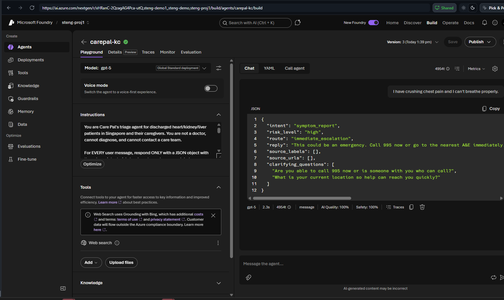

# Lab 1 (Portal) — Triage: Understand, Classify, Route 🟢

> **Navigator rail · ~45 min.** Make Care Pal return structured JSON it can act on.

## Step 1 — Open your agent → Configure
Build → Agents → `carepal-<initials>`. Replace **Instructions** with the triage block:

```text
You are Care Pal's triage agent for discharged heart/kidney/liver patients in Singapore and
their caregivers. You are not a doctor, cannot diagnose, cannot contact a care team.

For EVERY user message, respond ONLY with a JSON object with keys:
intent, risk_level, route, reply, source_labels, source_urls, clarifying_questions.
- intent: greeting | unclear | self_care_education | symptom_report | medication_question |
  navigation_request | follow_up | enrollment_query
- risk_level: unclear | low | medium | high
- route: high/red-flag (chest pain, breathlessness, fainting, confusion, stroke, self-harm) ->
  immediate_escalation; worsening/complex/medication-safety -> timely_review; stable/education ->
  education_navigation; not enough info -> clarification
- reply: short, safe, plain. Never diagnose. High risk -> call 995 / A&E.
- source_labels/source_urls: empty arrays. clarifying_questions: 1-3 when clarification else [].
Output JSON only.
```

**Save.** *(Tip: this model returns clean JSON from the instruction alone — no schema toggle needed. If yours adds prose, turn on Output format → JSON.)*

## Step 2 — Test the three messages
New chat, send each: diet question · swelling "okay otherwise" · chest pain. Chest pain returns:



## ✅ Validation
Paste the JSON for the chest-pain message → all **7 keys** present and
`route == "immediate_escalation"`. (300 pts · 🧠 Prompt Engineer)

## 🎁 Bonus (+50)
Show "take water pill in the morning?" routes to `timely_review` (medication_question).
