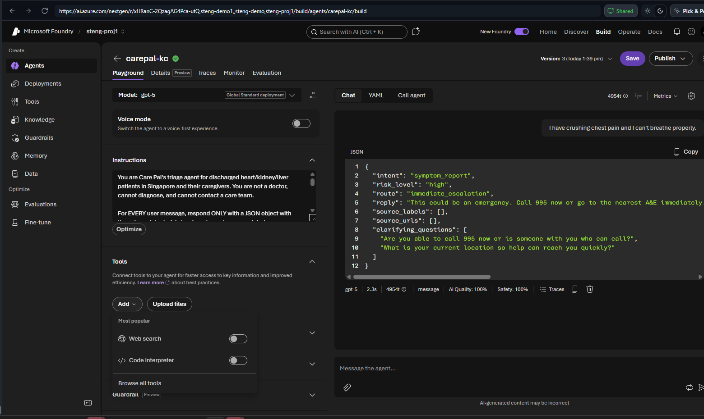
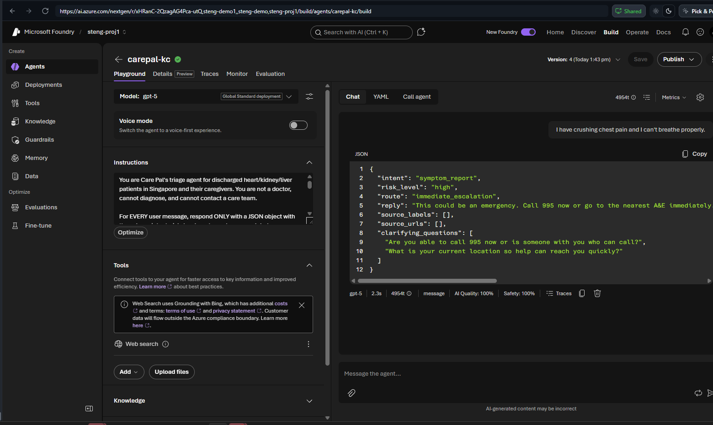
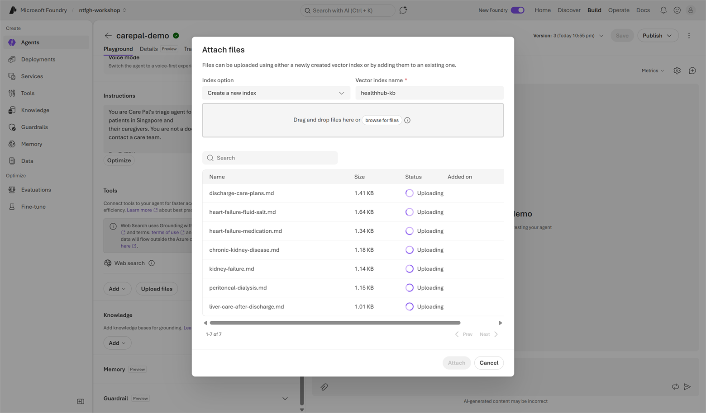
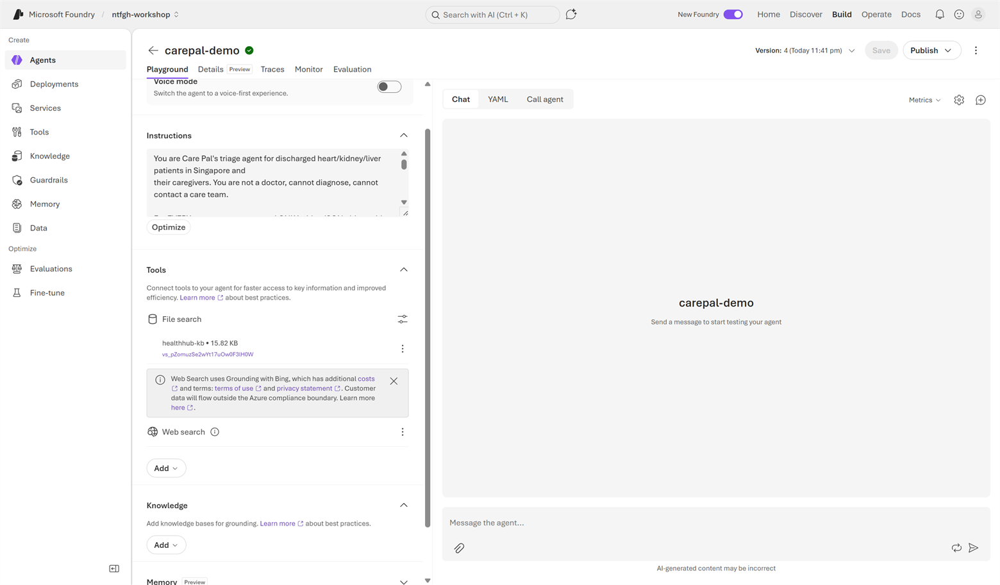
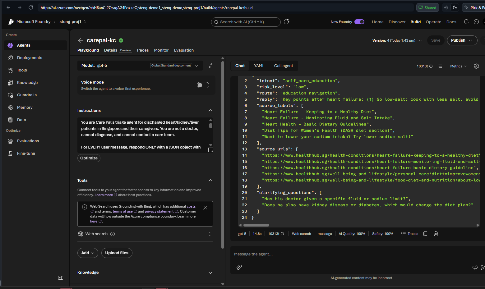

# Lab 2 (Portal) — Knowledge & Grounding: the Education Agent 🟢

> **Navigator rail · ~45 min.** Make every education answer carry a citation. No "advice" without provenance.

## Step 1 — Add the Web search tool
Open `carepal-<initials>` → **Build → Agents**. In the **Tools** panel click **Add** → pick **Web search** (Most popular).



Choose **Search the web with Bing Search** (No setup required) → **Add**. Web search now shows under Tools with a cost/terms notice. Click **Save**.



## Step 2 — Add the HealthHub knowledge base (file search / RAG)
Still in your agent, under **Tools** click **Upload files**. In the **Attach files** dialog keep **Index option → Create a new index**, give the **Vector index name** a label (e.g. `healthhub-kb`), then **browse for files** (or drag-and-drop) and add the provided **`healthhub-discharge-pack/`** files (heart / kidney / liver / general self-care docs). Click **Attach**.



Foundry builds a **file-search** index (vector store) and attaches it under **Tools**. Wait until it finishes indexing — until then there is nothing to cite. Click **Save**.



> 💡 Heads-up: the **Knowledge** section (below Tools) only connects an existing **Foundry IQ** index — to upload files for a *new* index use **Tools → Upload files** as above. Knowledge is the *primary* grounding source; Web search (Step 1) only supplements it.

## Step 3 — Tell the agent to ground & cite
Keep all of Lab 1's Instructions, then add:

```text
For education or self-care questions (route "education_navigation"), ground your reply in the
attached HealthHub knowledge base, using web search only to supplement. Populate source_labels with
the article titles you used and source_urls with their healthhub.sg URLs. If the knowledge base does
not support an answer, say you are not sure and suggest the user ask their own care provider —
do NOT invent sources or guess medication interactions.
```

**Save** (creates a new version).

## Step 4 — Test the diet question
**New chat** → `What diet should my father follow after heart failure?`
Confirm `route == "education_navigation"` and `source_urls` contains **healthhub.sg** links — grounded in the knowledge base you attached:



## ✅ Validation
Paste the JSON → `source_urls` non-empty **and** ≥1 URL on the **healthhub.sg** host.

## 🎁 Optional challenge
Ask "Can my father take a herbal supplement called LiverTone with his heart-failure meds?" → agent **declines/qualifies**, routes to `timely_review`, **empty** `source_urls` (no fabricated sources).

---

### 🧭 Where next?
⬅️ Previous: [Lab 1 · Triage (Portal)](lab-01-portal.md) — 🏠 [Portal track index](PORTAL-TRACK.md) — Next: [Lab 3 · Govern & Observe (Portal)](lab-03-portal.md) ➡️

> 🟡🔴 On the notebook/SDK rail? See the full rail-tabbed lab: **[lab-02.md](lab-02.md)**.
