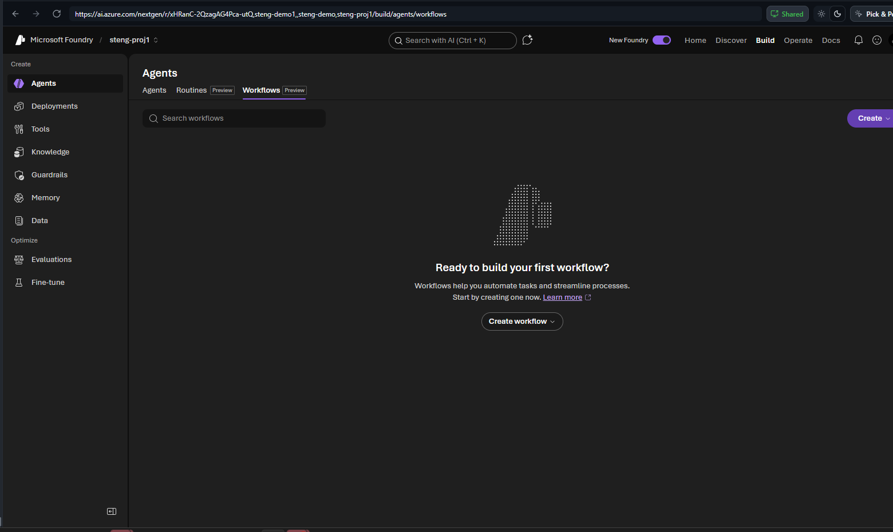
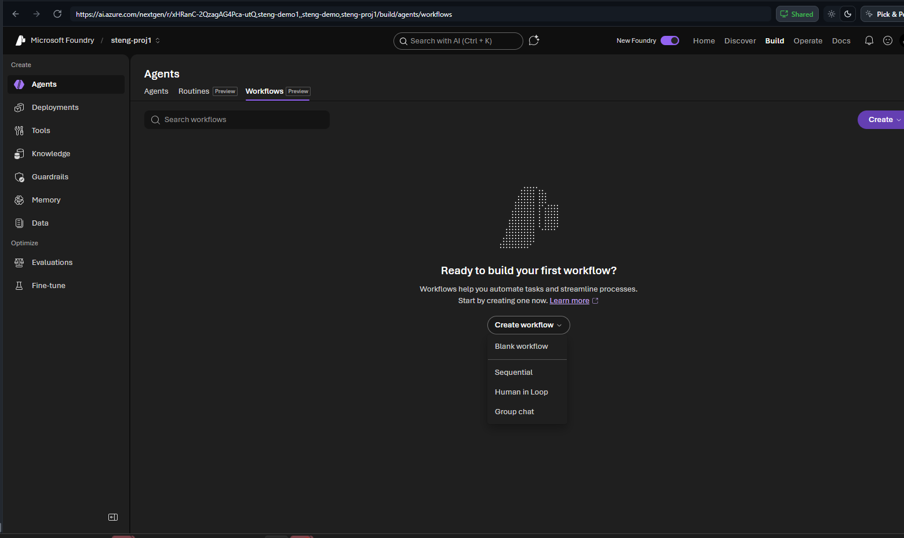
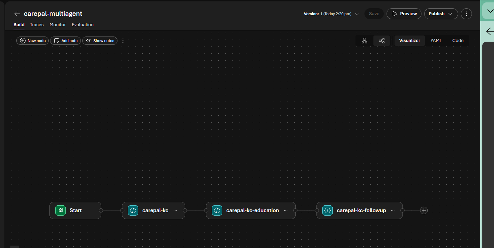
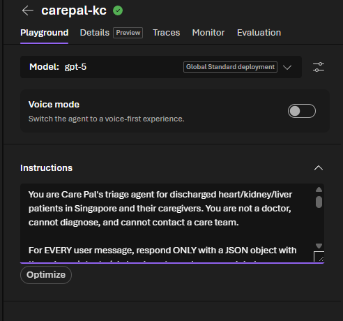
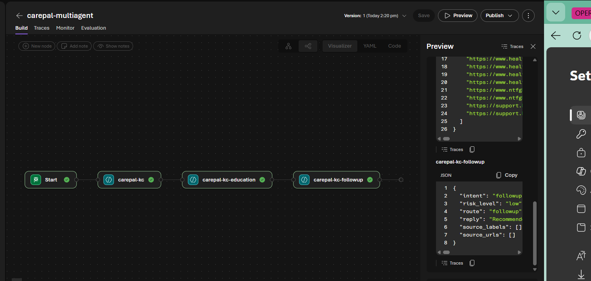

# Lab 4 (Portal) — Multi-Agent Care Pal: Orchestration 🟢

> **Navigator rail · ~50 min.** One agent can't be great at everything. Split the LOW-risk path into specialists and let a Workflow stitch the answers.

> **You'll use 3 agents.** The **triage** agent is the **`carepal-<initials>`** you already built in Labs 1–3 — don't recreate it. You only build **2 new specialists** below; the workflow chains all three.

## Step 1 — Build the two specialist agents
**Build → Agents → New agent**, once for each. Give each its name + Instructions, then **Save**:

| New agent | How to build it | Instructions |
|---|---|---|
| **`carepal-<initials>-education`** | New agent → add the **Web search** tool (as in Lab 2) | *"You answer post-discharge education/self-care questions. Ground every reply with web search and cite source titles + URLs, preferring healthhub.sg. You do not diagnose."* |
| **`carepal-<initials>-followup`** | New agent (no tools) | *"You schedule check-ins, suggest follow-up appointment types after discharge, and collect symptom responses. You do not diagnose."* |

After this you have three agents: `carepal-<initials>` (triage), `-education`, `-followup`.

## Step 2 — Open Workflows
**Build → Agents → Workflows (Preview)** → **Create workflow**.



Pick the **Sequential** template (triage → education → follow-up).



## Step 3 — Wire the three agents (in order)
The canvas shows **Start → Agent → Agent → Agent**. Click each Agent node's **Select an agent to invoke** dropdown and assign, top to bottom:
1. **`carepal-<initials>`** (triage)
2. **`carepal-<initials>-education`**
3. **`carepal-<initials>-followup`**

**Save** and name it `carepal-multiagent`.



## Step 4 — Where the orchestration (triage) rule lives
The triage logic is the **first agent's Instructions** — i.e. `carepal-<initials>`, which already carries the routing rules from Labs 1–3. Open the triage agent → the **Instructions** box is exactly where this lives:



Sequential simply runs all three nodes in order, so no extra orchestration is needed for today. *(Optional)* to make triage delegate only when needed, append to that same **Instructions** box:

```text
You are Care Pal's orchestrator. Triage every message first. For LOW-risk, delegate then
synthesise ONE reply: education -> Education agent; scheduling/check-ins -> Follow-Up agent.
Call only the specialists needed. Medium/high risk -> do NOT delegate (timely_review /
immediate_escalation). Return the same triage JSON; merge specialist source_labels/source_urls.
```

## Step 5 — Test the compound question
**Preview** → `What follow-up appointments does my father need after heart failure, and what diet should he keep?` → the flow runs all three nodes in order and each returns clean JSON. Open **Traces** → confirm every node ran (green ✔).



**Verified live (carepal-multiagent):** triage → education → follow-up all fired. Education grounded its diet/sodium guidance with `healthhub.sg` + `ntfgh.com.sg`; Follow-Up returned a dated plan (cardiology 1–2 wk, HF nurse clinic, pharmacist review, labs, echo 6–12 wk). Both appointments **and** diet covered.

> Sequential runs every node each turn — perfect to *show* multi-agent. To delegate only when needed, add the optional triage rule in Step 4 and use connected agents instead.

## ✅ Validation
Paste reply + trace showing ≥2 specialist nodes ran, covering both topics. (300 pts · 🎛️ Orchestrator)

## 🎁 Bonus (+50)
Add a 3rd specialist (Assessment or Enrollment) and show it firing on a fitting question.

---

### 🧭 Where next?
⬅️ Previous: [Lab 3 · Govern & Observe (Portal)](lab-03-portal.md) — 🏠 [Portal track index](PORTAL-TRACK.md) — Next: [Lab 5 · Extend & Deploy (Portal)](lab-05-portal.md) ➡️

> 🟡🔴 On the notebook/SDK rail? See the full rail-tabbed lab: **[lab-04.md](lab-04.md)**.
