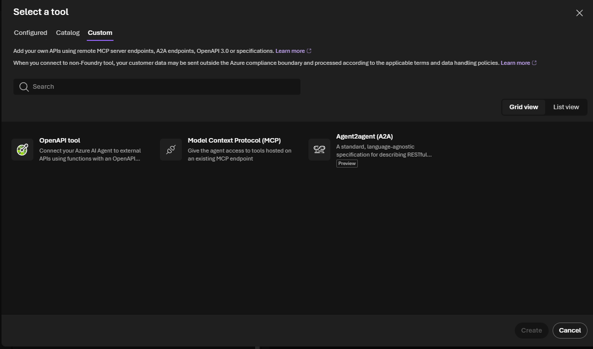
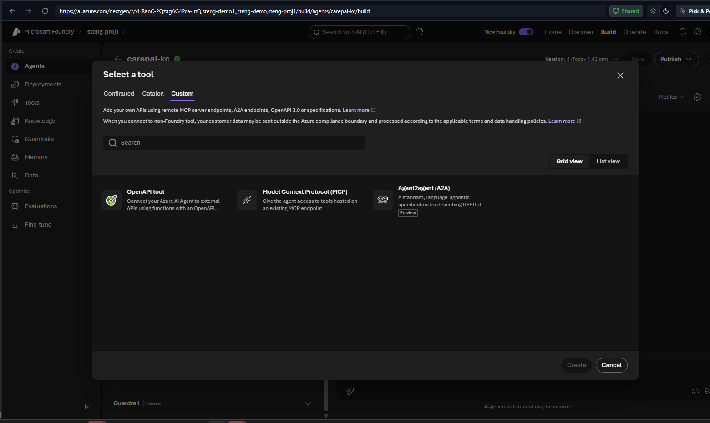
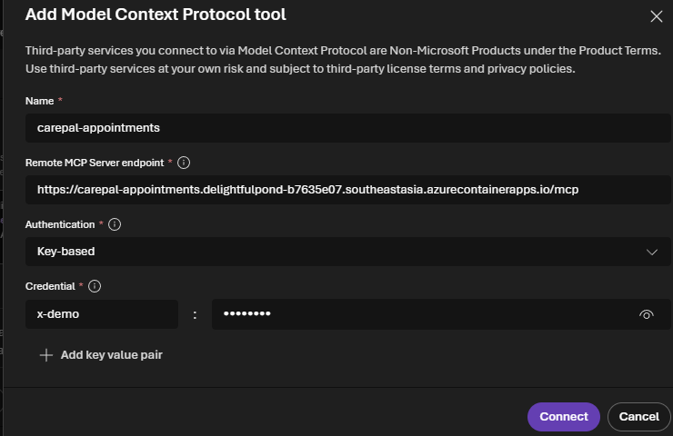
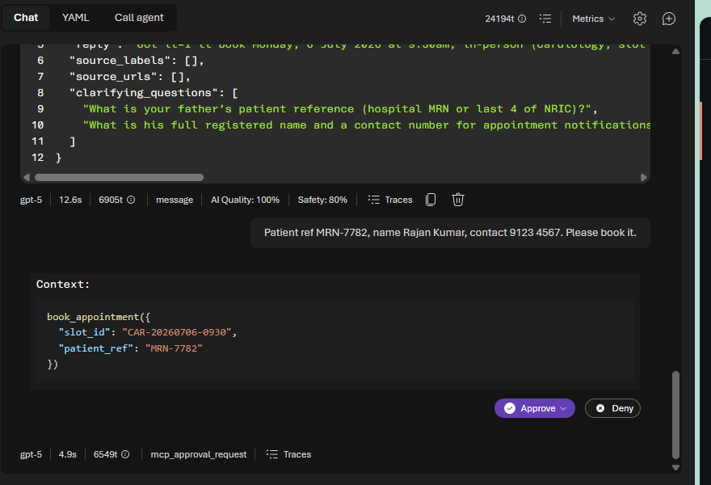
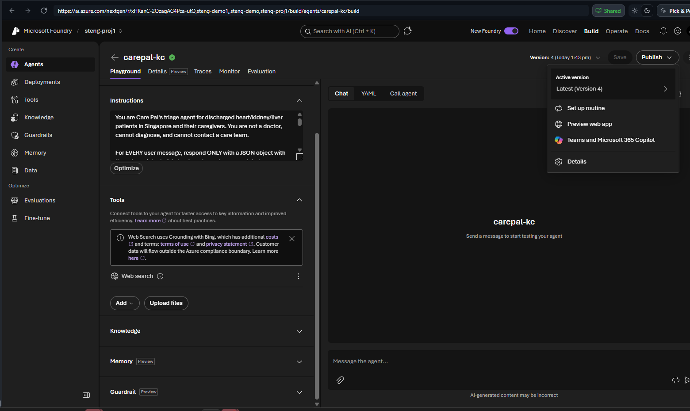
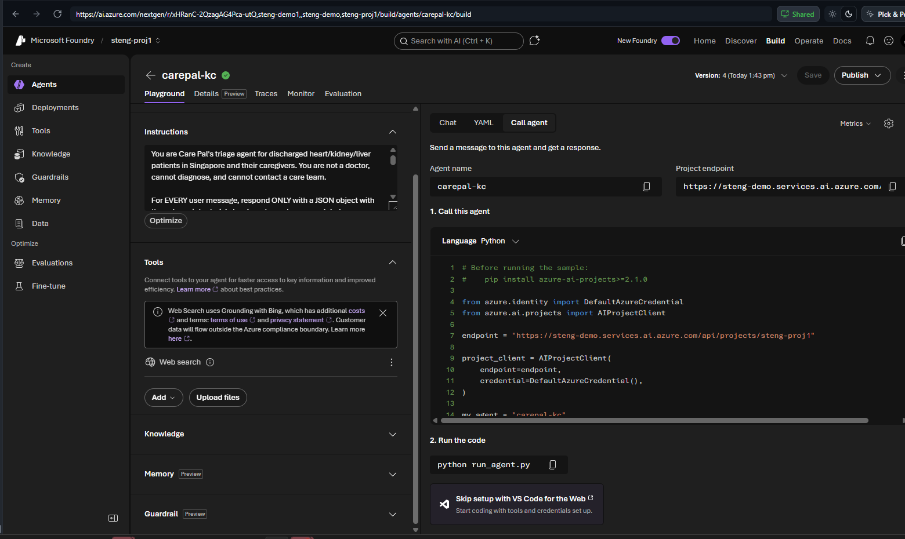

# Lab 5 (Portal) — Extend & Deploy: MCP Tool + Hosted Agent 🟢🔴

> **Demo for everyone · hands-on for Engineers · ~30 min.** Give Care Pal a real tool, then run it as a managed service.

## Part A — Add a tool via MCP
> **Pre-deployed by the admin.** The mock **appointments MCP** is hosted once on Azure Container Apps
> (no authentication, synthetic data) and the link is shared in this guide — see *Setup* below. There's
> nothing to start; you just paste the URL. *(Admin: `mcp-appointments/deploy-mcp.ps1`.)*
>
> **MCP server URL (live):** `https://carepal-appointments.delightfulpond-b7635e07.southeastasia.azurecontainerapps.io/mcp`

1. On `carepal-<initials>` → **Tools → Add → Browse all tools**.



2. Open the **Custom** tab → **Model Context Protocol (MCP)** → **Create**.



3. Fill **Name** (`appointments`), paste the shared **Remote MCP Server endpoint** (the `/mcp` URL above).
   Foundry's MCP form only offers **Key-based** or **OAuth** (no "None"), so leave **Key-based** and add one
   throwaway pair (e.g. key `x-demo`, value `workshop`) — the server ignores it. **Connect**.



4. Set approval to **always** so the agent must ask before `book_appointment`. Chat: `Can you arrange my father's heart-failure follow-up next week?` → confirm the slot + give a patient ref → the agent calls `book_appointment` and pauses for **Approve / Deny**:



Approve → it returns a booking ref like `MOCK-CAR-20260706-0930` (synthetic).

> Human-in-the-loop: any "booking/medication" action should always require approval.

> 🧑‍💼 **Setup (admin, before the workshop).** Deploy the mock MCP once and share the `/mcp` URL above:
> ```powershell
> az login
> cd content/assets/mcp-appointments
> ./deploy-mcp.ps1            # public, no-auth Container App; prints the /mcp endpoint
> ```
> Builds from source (no Docker needed), stays up all day, synthetic data. See `mcp-appointments/README.md`.
>
> 💰 **Cost.** 0.5 vCPU / 1 GiB, min 1 replica (stays warm). The monthly free grant (180k vCPU-s, 360k GiB-s, 2M requests) covers most of it: **~$6 for two weeks** at workshop traffic, ~$15 worst-case if always active. Delete after with `az group delete -n rg-carepal-mcp`.

## Part B — Publish / deploy the hosted agent
Top-right **Publish** → choose a channel: **Preview web app**, **Teams and Microsoft 365 Copilot**, or set as active version.



> ⚠️ **Sandbox note.** The workshop tenant has **no Teams / Microsoft 365 license**, so the *Teams and Microsoft 365 Copilot* channel can be published but **not tested end-to-end** here. Just walk through the menu for awareness — use the **Preview web app** channel to actually try the published agent.

Engineers can deploy as code via **VS Code Foundry Toolkit** (Code Remote) or **azd up**.

## Validation — call the deployed agent
**Call agent** tab gives the **Project endpoint** + ready SDK snippet (`azure-ai-projects>=2.1.0`, the current API). Ping with the diet question and confirm valid 7-key triage JSON + healthhub.sg citation.



## ✅ Validation
Submit your endpoint/agent ID. (200 pts · 🚀 Deployer)

> **Navigator/Builder reflection (100 pts):** (1) What does MCP give an agent? (2) Why deploy vs playground? (3) One Care Pal task you'd give a real tool. (4) What should always need approval? (5) Rate 1–5.

## ⭐ Optional stretch — connect a channel (demo only)
Out of timebox — skip with no penalty. Surface hosted Care Pal on a WhatsApp/Telegram sandbox. (+100 · 📲 Channel Pioneer)
