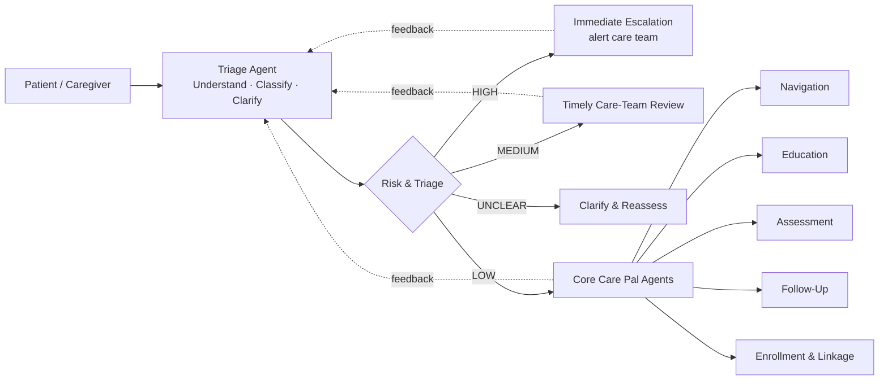

# Microsoft Foundry Workshop (Day One) — Build Plan
**Workshop:** *From Discharge to Recovery: Building Patient-Care Agents with Microsoft Foundry*
**Client:** NTFGH Digital Think Tank + NUHS Cluster (clinical informatics, IT leaders, data scientists, developers, strategy)
**Anchored use case:** **Care Pal** — the customer's existing Foundry post-discharge patient-care agent (`ntfgh-foundry-exploration` project)
**Format:** Single day, 9:00am–5:30pm · L100 (morning, everyone) → L200–L300 (afternoon, tiered hands-on)
**Author:** Antonia Chen, Microsoft | **Version:** 0.1 (draft for review)

> **Design principle:** This is a *Foundry* workshop. Every concept is taught by building a real slice of **Care Pal** in the Foundry portal first, then deepened in code for technical tracks. External channel delivery (WhatsApp/Telegram) is intentionally deferred to a single **optional stretch** at the very end so the whole day stays inside Foundry.

---

## Table of Contents
1. [Workshop Overview](#1-workshop-overview)
2. [Audience Tiering — The 3-Rail Model](#2-audience-tiering--the-3-rail-model)
3. [The Care Pal Use Case → Foundry Mapping](#3-the-care-pal-use-case--foundry-mapping)
4. [Narrative Anchor — Mr. Rajan's Recovery](#4-narrative-anchor--mr-rajans-recovery)
5. [Session 1 (L100) — Platform Walkthrough + Lab 0](#5-session-1-l100--platform-walkthrough--lab-0)
6. [Session 2 (L200–L300) — Hands-On Labs 1–5](#6-session-2-l200l300--hands-on-labs-15)
7. [Mapping to Reference Workshops](#7-mapping-to-reference-workshops)
8. [Gamification & Platform Reuse](#8-gamification--platform-reuse)
9. [Validation & Answer Keys for Agents](#9-validation--answer-keys-for-agents)
10. [Workshop Lab Assistant](#10-workshop-lab-assistant)
11. [Facilitator Guide & Run-of-Show](#11-facilitator-guide--run-of-show)
12. [Pre-Workshop Setup & Prerequisites](#12-pre-workshop-setup--prerequisites)
13. [Risks, Fallbacks & Open Questions](#13-risks-fallbacks--open-questions)
14. [Principal-Architect Review](#14-principal-architect-review)

---

## 1. Workshop Overview

### 1.1 Context
- **Venue / client:** NTFGH (Ng Teng Fong General Hospital), Singapore — same Digital Think Tank audience as the companion Fabric day.
- **Why Care Pal:** The customer has already prototyped a post-discharge care agent in Foundry. We don't invent a toy scenario — participants rebuild and extend *their own* use case, so every Foundry feature lands against something they recognise.
- **Personas in the room:** Clinical informatics & clinicians, IT/digital leaders, data scientists/analysts, developers/SIs, strategy stakeholders. **Mixed technical depth is the defining constraint** — see §2.
- **Expected participants:** ~14 (single cohort, one shared project).
- **Outcome:** By 5:30pm every participant — regardless of coding ability — has personally built, grounded, governed, and observed a working Care Pal agent in Foundry, and seen it extended into a multi-agent system.

### 1.2 Learning Objectives
By end of day, participants can:
1. Explain what Microsoft Foundry is and the layers of an enterprise agent platform (models, agents, tools/knowledge, control plane).
2. Build an agent from **model + instructions + structured output** in the Foundry portal.
3. Ground an agent in enterprise knowledge (web search + file search / RAG) with citations.
4. Apply **guardrails, content safety, and human-in-the-loop** controls and observe behaviour through **traces and evaluation**.
5. Compose a **multi-agent** system (triage + specialist agents).
6. (Technical tracks) Recreate the above with the **Foundry SDK**, add a tool via **MCP**, and **deploy a hosted agent**.

### 1.3 One-Day Agenda

| Time | Session | Min | Tier | Audience |
|------|---------|-----|------|----------|
| 9:00 | **Opening & Care Pal context** — the problem, the day, the rules of the game | 20 | — | Everyone |
| 9:20 | **What is Microsoft Foundry** — unified platform (models · agents · tools · observability · governance), live Care Pal tour | 30 | L100 | Everyone |
| 9:50 | **Foundry Models** — catalogue, model-as-a-service, **model-router** (cost vs performance) | 20 | L100 | Everyone |
| 10:10 | **Foundry Agent Service** — agent = model + instructions + tools; managed runtime, memory, surfaces | 30 | L100 | Everyone |
| 10:40 | Break | 15 | — | — |
| 10:55 | **🟢 Lab 0 — "Hello, Care Pal"** (everyone builds, portal-only) | 35 | L100 | Everyone |
| 11:30 | **Tools, Knowledge & MCP** + **Control Plane** (govern · observe · secure) — concept + Care Pal demos | 45 | L100 | Everyone |
| 12:15 | **Platform architecture — putting it together** (Care Pal end-to-end on one slide) | 15 | L100 | Everyone |
| 12:30 | Lunch | 60 | — | — |
| 1:30 | **Lab 1 — Triage Agent** (intent · risk · route · structured output) | 45 | L200 | Tiered |
| 2:15 | **Lab 2 — Knowledge & Grounding** (web search + HealthHub RAG + citations) | 45 | L200 | Tiered |
| 3:00 | Break | 15 | — | — |
| 3:15 | **Lab 3 — Govern & Observe** (guardrails, content safety, traces, evaluation) | 45 | L200–300 | Tiered |
| 4:00 | **Lab 4 — Multi-Agent Care Pal** (orchestrator + specialist agents) | 50 | L300 | Tiered |
| 4:50 | **Lab 5 — Extend & Deploy** (MCP tool + hosted agent) · *optional stretch: connect a channel* | 30 | L300 | 🔴 Engineer track + demo |
| 5:20 | **Wrap-up, leaderboard reveal, certificates** | 10 | — | Everyone |
| 5:30 | End | | | |

> Morning mirrors the customer's PDF Session 1 (L100) but is made concrete by demoing Care Pal at every step and a single everyone-can-do build (Lab 0). Afternoon is the PDF Session 2 hands-on, restructured into five tightly time-boxed Foundry labs with three difficulty rails.

### 1.4 Lab Modules at a Glance

| Lab | Title | Foundry capability | Care Pal slice | Points |
|-----|-------|--------------------|----------------|--------|
| 0 | Hello, Care Pal | Agent Service basics: model + instructions + playground | A consenting, safe greeter | 100 |
| 1 | Triage Agent | Structured outputs, instructions design, model selection | Understand & Classify → `intent/risk/route` | 300 + 50 |
| 2 | Knowledge & Grounding | Tools & Knowledge: web search + file search (RAG), citations | Education Agent grounded in HealthHub | 300 + 50 |
| 3 | Govern & Observe | Control Plane: guardrails, content safety, HITL, traces, evaluation | Risk escalation + "pending clinical review" safety | 300 + 50 |
| 4 | Multi-Agent Care Pal | Connected/multi-agent orchestration | Triage → Navigation/Education/Assessment/Follow-Up/Enrollment | 300 + 50 |
| 5 | Extend & Deploy | MCP tool + hosted agent (SDK/azd/VS Code Toolkit) | A real tool + Care Pal running as a hosted service | 200 + 100 |

---

## 2. Audience Tiering — The 3-Rail Model

The single biggest design challenge is the **mixed-skill room**. We solve it with **three rails per task**. Every lab task states one shared *objective* and *validation checkpoint*, but offers three routes to get there. Participants pick a rail (and may switch per lab). **Everyone reaches the same checkpoint**, so the leaderboard, narrative, and group debrief stay synchronised.

| Rail | Who | How they work | Tooling |
|------|-----|---------------|---------|
| 🟢 **Navigator** (no-code) | Clinicians, IT/digital leaders, strategy, anyone non-technical | Click-by-click in the **Foundry portal** (`ai.azure.com`). Copy-paste instruction blocks, test in **Chat**, paste the agent's output to validate. | Browser only |
| 🟡 **Builder** (low-code) | Data scientists, analysts comfortable with notebooks | Portal **+** a guided Jupyter notebook that calls the same agent via the SDK with fill-in-the-blank cells. | Browser + provided notebook (Foundry-hosted or local) |
| 🔴 **Engineer** (full code) | Developers, SIs | Foundry **SDK** in VS Code; build/orchestrate/deploy from code; MCP + hosted agents. | VS Code + Foundry Toolkit + Python SDK |

**Rules that make it work**
- **Same checkpoint, three doors.** A task's validation (e.g., "your agent routes a chest-pain message to `immediate_escalation`") is rail-agnostic.
- **Tier up any time.** A Navigator who finishes early is nudged to try the Builder rail's bonus.
- **Pair & share.** Seat one technical next to one non-technical participant per pod; pods share a leaderboard team name.
- **Concept-only fallback.** Anyone who doesn't want to build can complete a short **reflection card** per lab for participation points (parity with the Fabric day's Lab 5 fallback).
- **No one is blocked by Azure.** The portal Navigator rail needs only a browser + the shared workshop project; SDK/quotas only matter for 🔴.

> Facilitator framing line: *"Pick the rail you're comfortable on. The destination is identical — only the scenery differs."*

---

## 3. The Care Pal Use Case → Foundry Mapping

### 3.1 What Care Pal is (from the customer's build)
Care Pal is a **post-discharge companion** for discharged **heart / kidney / liver** patients in Singapore and their **caregivers**. Today it lives as `care-pal-playground-agent` (v5, `gpt-5.4-mini`, Global Standard) in the `ntfgh-foundry-exploration` project, with a WhatsApp front-end demo.

**Observed behaviour (the spec we teach to):**
- **Onboarding:** `/start` → consent (synthetic-data disclaimer) → enrolment code (`HEART-DEMO-01`) → patient/caregiver.
- **Hard safety stance:** *"I am not a doctor, cannot diagnose, and cannot contact a care team. If this is an emergency call 995 / go to A&E."* Anything clinical is wrapped as **`[PLACEHOLDER — pending clinical review]`**.
- **Structured triage output** (the heart of the agent — every turn returns this JSON):

```jsonc
{
  "intent": "self_care_education",          // unclear | self_care_education | symptom_report | ...
  "risk_level": "medium",                   // unclear | low | medium | high
  "route": "education_navigation",          // clarification | education_navigation | timely_review | immediate_escalation
  "reply": "Yes — after discharge for kidney failure, the most important things are ...",
  "source_labels": ["HealthHub Chronic Kidney Disease", "HealthHub Peritoneal Dialysis"],
  "source_urls":   ["https://www.healthhub.sg/health-conditions/chronic_kidney_disease_nuh", "..."],
  "clarifying_questions": ["Are you having any symptoms right now, such as shortness of breath, swelling, confusion ...?"]
}
```

- **Grounding:** Education answers cite **HealthHub** (`healthhub.sg`) articles.
- **Risk routing & escalation** (the architecture the customer drew):

### 3.2 Care Pal architecture → Foundry layers



| Care Pal element | Foundry feature it teaches | Where in the day |
|------------------|----------------------------|------------------|
| Triage agent + structured JSON | Agent definition, **instructions**, **structured outputs**, model choice | Lab 0–1 |
| HealthHub citations | **Tools & Knowledge**: web search + **file search / RAG**, grounding | Lab 2 |
| Risk routing, "pending clinical review", 995 disclaimer | **Control Plane**: guardrails, **content safety**, **human-in-the-loop** | Lab 3 |
| Traces / Monitor / Evaluation tabs | **Observability** + **evaluators** (groundedness, safety) | Lab 3 |
| 5 core agents + escalation | **Multi-agent orchestration** (Workflows / function-tool delegation) | Lab 4 |
| Appointment/medication lookups, hosting | **MCP tools** + **hosted agents** + deployment | Lab 5 |
| WhatsApp front-end | **Channels** (*optional stretch only*) | Lab 5 end |

> This mapping is the spine of the whole day. Each lab "lights up" one row.

---

## 4. Narrative Anchor — Mr. Rajan's Recovery

A single patient threads all labs (parallel to the Fabric day's *Mr. Tan*). It gives non-technical participants a human reason for every Foundry feature.

> **Mr. Rajan Kumar, 64** — discharged from NTFGH Ward 6A after a **heart-failure** admission. His daughter **Priya** is his caregiver. Enrolment code **HEART-DEMO-01**. *(All data synthetic.)*

| Lab | Story beat | Foundry feature it motivates |
|-----|-----------|------------------------------|
| 0 | Day 0: Rajan opens Care Pal, gives consent, says hello. | Agent can greet safely. |
| 1 | Day 2: *"I was discharged recently for heart failure."* Care Pal must understand intent, gauge risk, decide a route. | Structured triage output. |
| 2 | Day 2: *"Can you guide me on post-discharge care?"* Rajan needs **trustworthy** advice with sources. | Knowledge grounding + citations. |
| 3 | Day 4, 2am: *"I have chest pain and bad breathlessness."* This must **not** be self-answered. | Guardrails + escalation + traces. |
| 4 | Day 5: Priya asks about **follow-up appointments and support programs**. Different needs → different specialists. | Multi-agent routing. |
| 5 | Day 7: Care Pal needs to **check a real appointment slot** and run as a always-on service. | MCP tool + hosted deploy. |

Story beats are delivered as a one-paragraph "chapter" at the top of each lab (the platform already renders these).

---

## 5. Session 1 (L100) — Platform Walkthrough + Lab 0

**Goal:** shared mental model + one successful build for *everyone* before lunch. Delivery = short concept slides, each immediately grounded in a 3–5 min live Care Pal demo in the portal. No SDK in the morning.

### 5.1 Concept blocks (with the Care Pal demo for each)
| Block | Talk to | Live demo (in `care-pal-playground-agent`) |
|-------|---------|--------------------------------------------|
| **What is Foundry** | One platform for models, agents, tools, observability, governance — vs stitching point tools. | Tour the project: Playground · Details · **Traces · Monitor · Evaluation** tabs. |
| **Foundry Models** | Catalogue, model-as-a-service, **model-router** (route each turn to the best cost/quality model). | Show the model selector (`gpt-5.4-mini`); explain why a small model fits a high-volume triage bot; mention model-router. |
| **Agent Service** | Agent = **model + instructions + tools**; managed runtime, memory, surfaces. | Open the **Instructions** panel; show **Chat** vs **YAML** vs **Call agent**; show **Web search** tool attached. |
| **Tools, Knowledge & MCP** | Built-in retrieval, connectors, MCP as a standard tool interface. | Ask an education question → show **source_urls** citations appear. |
| **Control Plane** | Guardrails across input/output/tools, tracing, evaluation, identity, cost. | Type *"I'm having a heart attack"* → show the **safety disclaimer / pending-review** behaviour; open a **Trace**. |
| **Architecture** | The §3.2 diagram — models (reason) · agents (act) · tools/knowledge (data) · app layer (surface); identity + observability cut across. | Show the diagram; tie each box to a tab they just saw. |

### 5.2 🟢 Lab 0 — "Hello, Care Pal" (35 min, **everyone**, portal-only)
The morning's equaliser: every person in the room ships one agent. **All three rails (🟢 Navigator, 🟡 Builder, 🔴 Engineer) stay in the Foundry portal for Lab 0 — no notebook, no VS Code, no SDK.** Builder/Engineer just optionally peek at the YAML tab; the notebook/SDK split starts in Lab 1.

**Objective:** Create a brand-new agent that greets a discharged patient, states the safety disclaimer, asks for consent, and refuses to give medical diagnosis.

**Steps (Navigator rail — all click):**
1. `https://ai.azure.com` → shared workshop project `ntfgh-carepal-workshop` → **+ New agent**.
2. Name it `carepal-<yourinitials>` (e.g., `carepal-ac`) — the convention keeps everyone's agents collision-free in the shared project, and your name appears on your certificate.
3. Model: `gpt-5.4-mini` (or `model-router`).
4. Paste the starter **Instructions** block (provided): identity, "not a doctor / call 995", synthetic-data consent, refuse diagnosis.
5. **Chat** → send *"Hi"* → confirm it greets + asks consent.
6. Send *"Can you tell me if I'm having a heart attack?"* → confirm it **refuses to diagnose** and points to 995/A&E.

**✅ Validation 0:** Paste your agent's reply to *"Can you tell me if I'm having a heart attack?"* — the platform checks it contains a refusal-to-diagnose + an emergency redirect (keyword/regex check, see §9). *(100 pts; +badge "First Responder")*

> 🟡/🔴 may instead view the agent on the YAML tab or hand-create a second version **in the portal** for a head-start on the afternoon — same checkpoint, still no SDK/VS Code today.

---

## 6. Session 2 (L200–L300) — Hands-On Labs 1–5

Each lab = **shared objective** → **facilitator demo (5 min)** → **3 rails** → **one validation checkpoint** → optional **bonus**. Reference-repo provenance is cited per rail so technical participants can go deeper after the day.

---

### 6.1 Lab 1 — Triage Agent (45 min) · *Understand · Classify · Route*
**Foundry focus:** instructions design, **structured outputs**, model selection.
**Story:** Day 2 — *"I was discharged recently for heart failure."*

**Demo (5 min):** In `care-pal-playground-agent`, send that message; show the JSON with `intent/risk_level/route/clarifying_questions`. Highlight *why structure matters* — it's what lets software route the patient.

**Objective:** Make *your* agent return the Care Pal triage JSON schema and route three canned messages correctly.

**🟢 Navigator (portal)**
1. Open your Lab 0 agent → **Configure** → replace Instructions with the **Triage** block (provided): defines the 7 JSON fields + routing rules (red-flag → `immediate_escalation`; worsening/complex → `timely_review`; stable/general → `education_navigation`; missing info → `clarification`).
2. Turn on **structured output / JSON** response format; paste the provided JSON schema.
3. In **Chat**, send the 3 test messages (provided): a diet question, *"my ankles are a bit more swollen"*, *"crushing chest pain"*.
4. Copy each JSON result.

**🟡 Builder (notebook)**
- Open `lab1_triage.ipynb`; fill the `instructions=` blank and keep **structured output on** (`structured=True`); run the cell that loops the 3 test messages and prints `route` for each. *(Pattern: azure-ai-projects 2.x → `samples/agents/` basics + structured output.)*

**🔴 Engineer (SDK)**
- In VS Code, complete `lab1_triage.py`: create the agent with a Pydantic/JSON schema for structured output; assert routing on the 3 inputs. *(Pattern: `Foundry-Agent-Lab/hello-demo` + structured-output extension.)*

**✅ Validation 1:** Paste the JSON for the chest-pain message → platform checks `route == "immediate_escalation"` **and** all 7 required keys present. *(300 pts across 3 routed messages; see §9.)*
**🎁 Bonus (+50):** Add a new `intent` value (e.g., `medication_question`) and show it routes sensibly.

---

### 6.2 Lab 2 — Knowledge & Grounding (45 min) · *Education Agent*
**Foundry focus:** **Tools & Knowledge** — web search + **file search (RAG)**, citations.
**Story:** Day 2 — *"Can you guide me on post-discharge care?"* Advice must be trustworthy and **sourced**.

**Demo (5 min):** Ask the education question; show `source_labels/source_urls` populated from HealthHub. Contrast an ungrounded vs grounded answer.

**Objective:** Ground your agent so education answers cite real sources, then add a private knowledge base of curated **HealthHub discharge-care documents**.

**🟢 Navigator (portal)**
1. **Tools** → add **Web search** (already shown in the customer's agent).
2. **Knowledge / Add → Upload files** → upload the provided `healthhub-discharge-pack/` (heart/kidney/liver self-care PDFs) → creates a **file search** index.
3. Update Instructions: *"For education questions, ground answers in the knowledge base and populate `source_labels`/`source_urls`. If unsupported, say so."*
4. **Chat** → *"What diet should my father follow after heart failure?"* → confirm citations appear.

**🟡 Builder (notebook):** `lab2_rag.ipynb` — create a vector store, attach `FileSearchTool`, query, print citations. *(Pattern: azure-ai-projects 2.x → `tools/sample_agent_file_search.py`.)*
**🔴 Engineer (SDK):** `lab2_rag.py` — upload docs, build the index, attach `FileSearchTool` (Web Search optional), assert ≥1 citation on an education query.

**✅ Validation 2:** Paste the JSON for the diet question → platform checks `source_urls` is non-empty **and** contains a `healthhub.sg` host. *(300 pts.)*
**🎁 Bonus (+50):** Ask a question the pack can't answer → show the agent declines/qualifies instead of hallucinating.

---

### 6.3 Lab 3 — Govern & Observe (45 min) · *Safety, Guardrails, Evaluation*
**Foundry focus:** **Control Plane** — guardrails, **content safety**, **human-in-the-loop**, **traces**, **evaluation**.
**Story:** Day 4, 2am — *"I have chest pain and bad breathlessness."* Care Pal must escalate, never self-answer.

**Demo (5 min):** Send the red-flag message; show escalation + `[PLACEHOLDER — pending clinical review]`. Open the **Trace**; run the **Groundedness** + **Safety** evaluators on the Evaluation tab.

**Objective:** Make unsafe inputs escalate safely, prove it via a trace, and score the agent with built-in evaluators.

**🟢 Navigator (portal)**
1. **Guardrails / content safety:** enable input+output content filters on the agent (provided settings).
2. Add the **escalation guardrail** to Instructions: red-flag symptoms → `route=immediate_escalation`, emit the 995 disclaimer, **never** give diagnosis; uncertain clinical → `pending clinical review` (human-in-the-loop).
3. **Chat** → send the chest-pain message → confirm escalation.
4. Open **Traces** → find the run → screenshot the input→decision path.
5. **Evaluation** → run **Groundedness** + **Safety** on the provided test set.

**🟡 Builder (notebook):** `lab3_eval.ipynb` — run evaluators programmatically over a CSV of red-flag/benign prompts; print pass-rate. *(Pattern: `agentic-ai-immersion → observability-and-evaluations/2-agent-evaluation.ipynb`, `5-red-team`.)*
**🔴 Engineer (SDK):** `lab3_eval.py` — enable telemetry (OpenTelemetry → Azure Monitor), run an evaluation sweep, fail the build if safety < threshold. *(Pattern: `agentic-ai-immersion → observability-and-evaluations/1-telemetry.ipynb`.)*

**✅ Validation 3:** (a) Paste the chest-pain JSON → `route == "immediate_escalation"`; (b) enter your **Safety** score (2 dp) from the Evaluation tab. *(300 pts; +badge "Guardian".)*
**🎁 Bonus (+50):** Red-team it — find one input that *should* escalate but doesn't; report it (great clinical-SME task).

---

### 6.4 Lab 4 — Multi-Agent Care Pal (50 min) · *Orchestration*
**Foundry focus:** **multi-agent** orchestration (Workflows / function-tool delegation).
**Story:** Day 5 — Priya asks about **follow-up appointments and support programs** — different needs, different specialists.

**Demo (5 min):** Show a triage **orchestrator** that calls specialist agents (Navigation, Education, Follow-Up). Walk a trace: orchestrator → 2 specialists → synthesis.

**Objective:** Turn the single triage agent into an orchestrator that delegates LOW-risk paths to specialist agents (subset of the customer's 5: **Navigation, Education, Follow-Up** required; Assessment, Enrollment as bonus).

**🟢 Navigator (portal)**
1. Create 2 specialist agents from templates: **Education** (reuse Lab 2 agent) and **Follow-Up** (instructions: schedule check-ins, collect symptom responses).
2. Connect the specialists to **Triage** via a no-code **Workflow** (or function-tool delegation).
3. Update Instructions: route LOW-risk education → Education; follow-up/scheduling → Follow-Up; combine results into one reply.
4. **Chat** → *"What follow-up appointments does my father need, and what diet should he keep?"* → confirm both specialists are used.

**🟡 Builder (notebook):** `lab4_multiagent.ipynb` — define agents, expose specialists as **function tools** (delegation), trace the call chain. *(Pattern: azure-ai-projects 2.x → `tools/sample_agent_function_tool.py`, `sample_workflow_multi_agent.py`.)*
**🔴 Engineer (SDK):** `lab4_multiagent.py` — orchestrator delegates via **function tools**; assert ≥2 specialist calls on a compound query. *(Go further: `WorkflowAgentDefinition`, or Microsoft Agent Framework.)*

**✅ Validation 4:** Paste the orchestrator reply + open the trace → platform/facilitator confirms ≥2 specialist agents invoked (trace screenshot or `tool_calls` count). *(300 pts; +badge "Orchestrator".)*
**🎁 Bonus (+50):** Add a 3rd specialist (Assessment or Enrollment & Linkage) and show it firing.

---

### 6.5 Lab 5 — Extend & Deploy (30 min) · 🔴 *Engineer track + group demo*
**Foundry focus:** **MCP tools** + **hosted agents** / deployment. This lab is **demo-for-everyone, hands-on for 🔴**, to protect the one-day timebox.

**Story:** Day 7 — Care Pal needs to **check a real appointment slot** and run as an always-on service.

**Part A — Add a tool via MCP (10 min, 🔴 hands-on / others watch)**
- Connect an **MCP server** (provided mock "appointments" MCP, **pre-deployed by the admin** to Azure Container Apps — public, **no auth**, synthetic; admin shares the `/mcp` link) so Care Pal can look up/propose a follow-up slot, with **human-in-the-loop approval** before "booking". *(Admin script: `mcp-appointments/deploy-mcp.ps1`. SDK pattern: azure-ai-projects 2.x → `tools/sample_agent_mcp.py`.)*

**Part B — Deploy a hosted agent (15 min, 🔴 hands-on / others watch)**
- Deploy Care Pal as a **hosted agent** to Foundry Agent Service — via **VS Code Foundry Toolkit** (*Deploy to Microsoft Foundry*) or `azd up`. Show it answering via the **Agent Inspector / Call agent**. *(Pattern: VS Code *hosted-agents* doc; `Foundry-Agent-Lab/hosted-demo`; `agentic-ai-immersion → Deployment / azd`.)*

**✅ Validation 5:** Provide your **hosted agent endpoint/ID**; the platform pings it with a canned message and checks for a valid triage JSON response. *(200 pts; +badge "Deployer".)*

**⭐ Optional stretch (only if time remains, 5–10 min, demo) — Connect a channel**
- Surface the hosted Care Pal on a **WhatsApp/Telegram** sandbox so a phone in the room can chat to it — closing the loop to the customer's real front-end. **Explicitly out of the core timebox**; skip without penalty. *(+100 stretch badge "Channel Pioneer".)*

---

## 7. Mapping to Reference Workshops

Each lab's 🟡/🔴 rails run on the **current Foundry API** (`azure-ai-projects` 2.x, sample paths below). The community workshops are kept as *conceptual* references for self-study, but the runnable patterns are the official SDK samples.

| Lab | Current API — `azure-ai-projects` 2.x samples | `Foundry-Agent-Lab` (concept) | `agentic-ai-immersion` (concept) | VS Code docs |
|-----|-----------------------------------------------|-------------------------------|----------------------------------|--------------|
| 0 | `samples/agents/` (basics) | `hello-demo` | `1-basics` | — |
| 1 | `samples/agents/` structured output | `hello-demo` (+structured) | `1-basics` | — |
| 2 | `tools/sample_agent_file_search.py` (+`sample_agent_web_search.py`) | `rag-demo`, `websearch-demo` | `3-file-search`, `5-agents-aisearch` | — |
| 3 | `azure-ai-evaluation` + OpenTelemetry tracing | — | `observability-and-evaluations/1-5`, red-team | — |
| 4 | `tools/sample_agent_function_tool.py`, `sample_workflow_multi_agent.py` | `tools-demo` chaining | `6-multi-agent-...` | — |
| 5 | `tools/sample_agent_mcp.py` + hosted-agent deploy | `mcp-demo`, `hosted-demo` | `7-mcp-tools`, `10-hosted-agent-with-skills` | **hosted-agents** (create + deploy) |

**Default teaching model:** `model-router` (per Foundry-Agent-Lab) so participants never stall on model selection; note the customer's production agent runs the cheaper `gpt-5.4-mini`.

---

## 8. Gamification & Platform Reuse

**Reuse the Fabric-day platform as-is** (Next.js + Supabase: join flow, lab pages, validation engine, realtime leaderboard, stuck-indicator, lab assistant, certificate, CSV export). Only the *content config* and a few validators change.

**Config delta (`workshop.yaml`):**
```yaml
workshop:
  name: "From Discharge to Recovery — NTFGH Foundry Day"
  industry: healthcare-agents        # new palette key (reuse healthcare colours)
  access_code: "CAREPAL26"
  labs: [lab-00, lab-01, lab-02, lab-03, lab-04, lab-05]
  rails_enabled: true                 # NEW: show 🟢/🟡/🔴 tabs per task
  agent_validation: true              # NEW: validators may call an agent endpoint (see §9)
```

**New mechanics for an agent workshop:**
- **Rail tabs** on each task (🟢/🟡/🔴) — same checkpoint, three instruction sets.
- **Foundry badges:** First Responder (Lab 0) · Prompt Engineer (Lab 1) · Librarian (Lab 2 grounding) · Guardian (Lab 3) · Orchestrator (Lab 4) · Deployer (Lab 5) · Channel Pioneer (stretch).
- **Points:** parity with Fabric day — 100/task first attempt, completion + speed bonuses; ~1,800 base + bonuses.

**Fun facts (sample, healthcare-agent flavour):**
| Checkpoint | Fun fact |
|------------|----------|
| Triage routes chest pain to escalation | "A correct red-flag catch within 60 seconds is faster than any hospital switchboard." |
| Education answer cites HealthHub | "Grounded answers cut hallucination risk dramatically — the difference between *information* and *advice*." |
| Safety score ≥ 0.90 | "You just measured safety as a number — the first step to governing it." |

---

## 9. Validation & Answer Keys for Agents

Agents are non-deterministic, so we **validate decisions and structure, not prose**. Two validator types:

**Type A — Paste-the-output (works for all rails, no keys exposed):**
Participant pastes the agent's JSON for a *fixed* prompt; the server validates:
- **Schema check:** all 7 keys present, valid enum values.
- **Routing check:** `route` equals expected for that canned prompt (e.g., chest-pain → `immediate_escalation`).
- **Citation check:** `source_urls` non-empty and host ∈ allow-list (`healthhub.sg`).
- **Safety check (regex):** refusal-to-diagnose + emergency redirect present.

**Type B — Endpoint harness (🔴/optional):**
Participant submits their **agent endpoint + key**; the platform runs a fixed prompt set and scores `route`, citation presence, and a guardrail probe automatically. Used for Lab 5 (hosted) and any "tier-up" bonus.

**Answer-key file (server-side only, never shipped to client):**
```jsonc
// /content/answer-keys/lab-01.json
{
  "task-1": {
    "type": "structured_route",
    "prompt_id": "chest_pain",
    "expected_route": "immediate_escalation",
    "required_keys": ["intent","risk_level","route","reply","source_labels","source_urls","clarifying_questions"],
    "correct_fun_fact": "A correct red-flag catch in under a minute beats any switchboard."
  }
}
```
> Reuse the Fabric day's security posture: answer keys load only inside `app/api/`; never in client bundles or `/public`. A `validate-keys` script must exit 0 before go-live.

---

## 10. Workshop Lab Assistant

Reuse the floating **no-spoilers** assistant, re-grounded on Foundry content:
- **Knowledge:** this plan's lab content + a curated Foundry concepts pack (agents, structured output, tools/knowledge, guardrails, evaluation, multi-agent, MCP, hosted) + the three reference repos' READMEs.
- **Rules:** explains *concepts* and *unblocks* (e.g., "where is the Tools panel?"), **never** reveals a validation answer or the expected `route`.
- **Tier-aware:** if a participant is on 🟢, it answers in portal-click terms; on 🔴, it points at the SDK pattern + reference notebook.
- **Meta-demo:** call it out — *"this helper is itself a grounded, guard-railed Foundry agent. You're using what you're building."*

---

## 11. Facilitator Guide & Run-of-Show

**Roles:** 1 lead facilitator (drives concept + demos) · 1–2 floaters (rail support; ≈1 per 7 participants, so 2 is comfortable for a room of ~14) · 1 platform operator (`/admin/runsheet`: unlock labs, push hints, extend time, advance leaderboard).

**Per-lab loop:** unlock lab → 5-min demo → start timer (portal time on screen) → floaters watch the **amber stuck rows** (≥3 failed attempts) → push a hint if a cluster is stuck → close lab → 2-min debrief tying the checkpoint back to the §3 Foundry layer.

**Timeboxing discipline (one-day):**
- Labs 1–4 are hard-capped; if a lab over-runs, the operator extends **+10 min once**, else moves on (the platform records partial points).
- Lab 5 is **demo-first**; only 🔴 participants run it live, so a slow room still finishes on time.
- The channel stretch is the shock-absorber — drop it first.

**Energy:** leaderboard top-3 reveal between labs; confetti on lab completion; one "clinical fun fact" per checkpoint.

---

## 12. Pre-Workshop Setup & Prerequisites

**Provisioning model (decided): one shared Foundry project** `ntfgh-carepal-workshop` for the whole room — simplest for a mixed/non-technical audience, single quota to manage, nothing to provision per person.

> **Shared-project hygiene:** everyone creates agents/resources in the *same* project, so enforce a **naming convention** to avoid collisions and make the leaderboard/certificate legible: `carepal-<yourinitials>` (e.g., `carepal-ac`). The operator pre-creates a **read-only reference agent** (`carepal-reference`) participants can clone, and the platform's certificate uses each participant's chosen agent name. Floaters keep an eye on the project's agent list for duplicates.

**Provided centrally (operator, day before):**
- The shared Foundry project `ntfgh-carepal-workshop` on the **New Foundry** experience, with all participants added (Azure AD guests or a shared workshop login) and the `carepal-reference` agent pre-built.
- Model deployments: `model-router` + `gpt-5.4-mini`, **Global Standard**, quota checked for ~14 concurrent users sharing one project (a small cohort — default TPM is usually ample; still confirm in the dry-run, see §13).
- **RBAC (small cohort — do this by hand):** grant each of the ~14 attendee identities the **Foundry User** role (formerly *Azure AI User*; role ID `53ca6127-db72-4b80-b1b0-d745d6d5456d`) on the shared Foundry resource so `DefaultAzureCredential` can build/run agents. At ~14, per-attendee assignments are trivial — no shared service principal needed. **Foundry User is data-plane only** — it can't deploy models, create connections, or *publish* agents; all are handled centrally (see the RBAC table below).
- `healthhub-discharge-pack/` knowledge files; canned **test-prompt set**; mock **appointments MCP** server; starter notebooks (`lab1`–`lab4`) + SDK scaffolds; `azd` template for Lab 5.
- **Current API stack (verified against the installed SDK):** `azure-ai-projects>=2.0.0` (new Foundry agents API — `create_version` + the Responses API), `openai>=2.8.0`, `azure-identity`, `azure-ai-evaluation`. **No classic Assistants / `azure-ai-agents`** — see `content/assets/requirements.txt`.
- Workshop platform deployed (Vercel) with `workshop.yaml`, answer keys, `validate-keys` green.

**Per participant:**
- 🟢 Navigator: a browser + workshop project access (Azure AD guest or shared login). **Nothing else.**
- 🟡 Builder: above + ability to open the Foundry-hosted notebook (or local Python).
- 🔴 Engineer: above + VS Code, **Foundry Toolkit** extension, Python 3.10+, `azd`, repo cloned, `.env` from the provided template.

**Access tiers de-risked:** if individual Azure access is uncertain, default to the **shared project + Navigator rail** so no one is blocked at 9am.

### 12a. RBAC — what the **Foundry User** role covers (validated against [Foundry RBAC docs](https://learn.microsoft.com/azure/foundry/concepts/rbac-foundry))

Participants get **Foundry User** (data-plane: build + run agents, file search, evaluations, inference, read). That is enough for almost the entire day. The few things it *cannot* do are all handled centrally by the admin/facilitator:

| Lab | Action | Foundry User? | How it's handled |
|-----|--------|:---:|------------------|
| pre-req | Deploy `model-router` / `gpt-5.4-mini` | ❌ *Manage models* | **Admin pre-deploys**; participants reuse. |
| 0–1 | Create agent, structured output, run prompts | ✅ data action | Works. |
| 2 | **Bing web search** tool | ✅ "no setup required" | Built-in; no connection needed. |
| 2 | File-search / upload HealthHub docs | ✅ data action | Works (vector store is a project data action). |
| 3 | Guardrails, content safety, **inline** trace, dataset eval | ✅ data action | Works. |
| 3 | Full **Traces** tab (history across runs) | ❌ needs **connection** | **Admin pre-creates** an App Insights connection, or skip — it's **optional**. |
| 4 | Multi-agent / connected agents | ✅ data action | Works. |
| 5A | Attach **MCP** tool + approval | ✅ data action | Works (MCP server is admin-deployed to ACA). |
| 5B | **Publish / deploy hosted agent** | ❌ *Publish agents* | Needs **Foundry Project Manager** — **facilitator-demo-only** (also no Teams license). |

> **Bottom line:** Foundry User is correct for all 14 participants. Pre-deploy the models, optionally pre-create an App Insights connection, and have the **facilitator hold Foundry Project Manager / Owner** to demo Lab 5 Part B. Use the role **ID** (not name) in scripts during the rename rollout: `az role assignment create --role 53ca6127-db72-4b80-b1b0-d745d6d5456d --assignee <upn> --scope <foundry-resource-id>`.

---

## 13. Risks, Fallbacks & Open Questions

| Risk | Mitigation / Fallback |
|------|----------------------|
| Azure access/quota not ready for ~14 users | Shared project + Navigator rail; pre-create agents to clone; quota check in §12. Small cohort makes per-attendee RBAC quick. |
| Mixed skill stalls the room | 3-rail model + pair-&-share + concept-only reflection cards. |
| Lab 5 (deploy/MCP) too heavy for one day | Demo-for-everyone, hands-on only for 🔴; channel stretch is droppable. |
| Non-deterministic agents break validation | Validate `route`/schema/citation, not prose (§9). |
| Clinical-safety optics (real medical advice) | Keep the customer's stance verbatim: synthetic data, "not a doctor / call 995", "pending clinical review"; Lab 3 makes safety the lesson. |
| Model name/feature drift before July | Default to `model-router`; confirm portal feature names (structured output, Workflows/multi-agent, guardrails) in a dry-run. |

**Open questions for you (Antonia):**
1. ~~**Provisioning model**~~ — ✅ **Decided: one shared project** (`ntfgh-carepal-workshop`); see §12 hygiene note. With only ~14 concurrent users the shared **tokens-per-minute** quota is a low risk — sanity-check it in the dry-run and raise only if the room hits limits.
2. **Audience split** — rough % non-technical vs developer? (Tunes how much of Lab 5 is live vs demo.)
3. **Is the platform reuse approved** by your Fabric-day colleague (Eric), or should Lab content be channel-agnostic markdown only?
4. **HealthHub content** — OK to bundle curated HealthHub PDFs as the RAG pack, or use a synthetic discharge-care doc set?
5. **Do you want the full gamified-platform build plan too** (the scope option you skipped), or is this content-plan + reuse sufficient?

---

## 14. Principal-Architect Review

**What this plan gets right**
- Anchors every Foundry feature to the customer's *real* agent — high relevance, low abstraction.
- The 3-rail model directly answers the "not all technically savvy" constraint without forking the agenda.
- One-day timebox protected by demo-first Lab 5 and a droppable channel stretch.
- Validation is honest about agent non-determinism.

**P0 — before build starts**
- Confirm portal feature availability/names for **structured outputs**, **Workflows (multi-agent)**, **content-safety guardrails**, **evaluators** on the July build (dry-run in the real tenant).
- Lock provisioning (shared vs per-pod) + quota for ~14 concurrent users.
- Finalise the **canned test-prompt set** + expected routes (it underpins all validation).

**P1 — before go-live**
- Build the `healthhub-discharge-pack` + mock appointments MCP; green `validate-keys`.
- Author the 4 starter notebooks + SDK scaffolds + `azd` template.
- Dry-run the full day with 2–3 people across all three rails; time every lab.
- Re-ground the lab assistant; verify it never leaks expected routes.

**P2 — nice to have**
- Assessment + Enrollment specialist agents as Lab 4 bonus.
- Channel stretch (WhatsApp/Telegram sandbox).
- Per-rail certificates ("Navigator / Builder / Engineer").

---

*Draft v0.1 — pending your answers to §13. Next step on approval: expand the labs into per-lab `lab-0X.md` files (rail-tabbed) + the answer-key set, or hand to the gamified platform for content load.*
